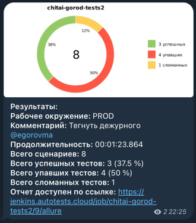

<h1 align="center">Проект по автоматизации тестирования онлайн магазина Читай-город</h1>
<p align="center">
<a href="https://www.chitai-gorod.ru/"></a>
</p>

>«Читай-город» – сеть книжных магазинов, успешно работающих в Москве и других регионах России. 
> А ещё это – крупный интернет-магазин книг. В нём вы можете заказывать книги в любое время 24 часа в сутки.

##  Содержание:
- <a href="#cases"> Тест-кейсы</a>
- <a href="#autotests"> Запуск автотестов</a>
- <a href="#jenkins"> Сборка в Jenkins</a>
- <a href="#allureReport"> Пример Allure-отчета</a>
- <a href="#tg"> Уведомления в Telegram с использованием бота</a>

Тесты написаны на языке <code>Java</code> с использованием фреймворка для автоматизации тестирования <code>[Rest Assured](https://rest-assured.io/)</code>, сборщик - <code>Gradle</code>.

<code>JUnit 5</code> задействован в качестве фреймворка модульного тестирования.


Для удаленного запуска реализована джоба в <code>Jenkins</code> с формированием Allure-отчета и отправкой результатов в <code>Telegram</code> при помощи бота.

____
<a id="cases"></a>
## 🕵️‍♂️ Тест-кейсы
Auto:
- Проверка поиска
- Проверка добавления продукта
- Проверка удаления продукта
- Проверка работы корзины
- //todo проверка обновления корзины

<a id="autotests"></a>
____
## ▶️ Запуск автотестов

### Запуск тестов из терминала

Для запуска тестов использовать команду ниже:
```
./gradlew clean api_test
```

---
<a id="jenkins"></a>
##  </a> Сборка в <a target="_blank" href="https://jenkins.autotests.cloud/job/chitai-gorod-tests/"> Jenkins </a>
Для доступа в Jenkins необходима регистрация на ресурсе [Jenkins](https://jenkins.autotests.cloud/) Для запуска сборки необходимо перейти в раздел <code>Build with parameters</code>, выбрать необходимые параметры и нажать кнопку <code>Build</code>.
<p align="center">

</p>
После выполнения сборки, в блоке <code>Build History</code> напротив номера сборки появятся значки <code>Allure Report</code>, при клике на которые откроется страница с сформированным html-отчетом.

____
<a id="allureReport"></a>
##  </a> Пример <a target="_blank" href="https://jenkins.autotests.cloud/job/chitai-gorod-tests/8/allure/"> Allure-отчета </a>
<p align="center">

</p>

____
<a id="tg"></a>
##  Уведомления в Telegram с использованием бота
После завершения сборки, бот, созданный в <code>Telegram</code>, автоматически обрабатывает и отправляет сообщение с отчетом 
о прогоне тестов в [специально настроенный чат](https://t.me/+m0gDb0Dy9ckwZTYy).
<div style="background-color: #18222d">
<p align="center">

</p>
</div>
